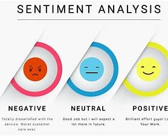

# Ssentiment Analysis
Extract sand-up comedy transcript, calculate polarity and sensitivity the text to determine its sentiment (positive or negative or neutral)

## Contents

1. Project Structure
2. Prosess
3. How to run
4. Deployment (Real world Use)
5. To improve
6. About Me

## 1. Project Structure

#### Data
* ├── pickle
* ├── transcripts
* ├── cleaning_result

#### analysis
* ├── 1_data_preprocessing.ipynb
* ├── 2_exploratory_data_analysis.ipynb
* ├── 3_sentiment_analysis.ipynb

#### figures
* ├── contains graph and figures
#### models
* ├── contains trained models
#### images
* ├── contains images used in this images

##### environment
##### requirements.txt
##### gitignore

## 2. Process

* step1 : Geting the data
* step2 : Clean data
* step3 : organize data
* step4 : Exploratory Data Analysis (EDA)
* step5 : Sentiment analysis
* step6 : Findings
* step7 : Model Deployment

## 3. How to run

**N.B : python 3.7 is recommended**

### 3.1. CLONE PROJECT DIRECTORY

+ $ git clonehttps://github.com/Rekidiang2/nlp01_sentiment_analysis.git
+ $ cd nlp01_sentiment_analysis

### 3.2. CREATE & ACTIVATE VIRTUAL ENVIRONMENT

#### 3.2.1. WITH PIP and VENV

##### (Windows) 
+ $ python -m venv nlp01_venv 
+ $ nlp01_venv\Scripts\activate (<= Activate virtual Environment)
+ $ deactivate (<= Deactivate virtual Environment)
+ $ pip install -r requirements.txt
+ Set  VIRTUAL ENVIRONMENT as KERNEL : 
  +  $ python -m ipykernel install --user --name nlp01_venv --display-name "p01ml_kernel"
+ $ jupyter notebook

##### (MasOS || LINUX)
+ $ python3 -m venv nlp01_venv 
+ $ source p01ml_venv/bin/activate (<= Activate virtual Environment)  
+ $ deactivate (<= Deactivate virtual Environment)
+ $ pip install -r requirements.txt
+ Set  VIRTUAL ENVIRONMENT as KERNEL : 
  +  $ python -m ipykernel install --user --name nlp01_venv --display-name "nlp01_kernel"
+ $ jupyter notebook

#### 3.2.2. WITH CONDA

+ Verify if you have conda installed ($conda --version) if not go to [anconda](https://www.anaconda.com/products/individual) or [miniconda](https://docs.conda.io/en/latest/miniconda.html) to download and install it

+ $ conda create -n nlp01_venv python=3.7
+ $ conda activate nlp01_venv (<= Activate virtual Environment)
+ $ conda deactivate  (<= Deactivate virtual Environment)
+ Set  VIRTUAL ENVIRONMENT as KERNEL : 
  +  $ python -m ipykernel install --user --name nlp01_venv --display-name "nlp01_kernel"
+ $ jupyter notebook
+ Go to Kernel -> Change kernel -> nlp01_kernel
+ $ jupyter kernelspec list (<= list all ipykernel in your system)
+ $ jupyter kernelspec uninstall nlp01_venv (<= Delete the ipykernel in your system)

#### Manage kernel
+ $ jupyter kernelspec list (<= list all ipykernel in your system)
+ $ jupyter kernelspec uninstall nlp01_venv (<= Delete the ipykernel in your system)

## 4. Deployment (Real world Use)

+ [WebApp with Streamlit]()
+ [WebApp with Flask]()

## 5. Deployed Link

+ coming soon

## 6. About Me
___

### Kiese Diangebeni Reagan
#### Data Science Analyst

> I’m  Data and technology passionate person, Artificial Intelligence enthusiast, lifelong learner. Since my childhood I was interested to technology and science, but I didn’t get access to it, by the lack of resource and opportunities hopefully grace to massive learning resource available on the Internet I’m getting close to my dream. My pleasure is to motivate, guide and teach people with less or without resource accomplish their dream in the world of technology specially kids and young.

> My Website [Click Here](https://kiese.tech)

> Social Network

[![alt text][1.1]][1]
[![alt text][2.1]][2]
[![alt text][3.1]][3]
[![alt text][4.1]][4]

[1.1]: https://i.imgur.com/oFsAcMx.png (facebook icon with padding)
[2.1]: https://i.imgur.com/YCdR3o9.png (twitter icon with padding)
[3.1]: https://i.imgur.com/5BWvIrF.png (github icon with padding)
[4.1]: https://i.imgur.com/UA7Oh6z.png (medium icon with padding)

[1]: http://www.facebook.com/reagan.kiese.37
[2]: https://twitter.com/ReaganKiese
[3]: https://github.com/Rekidiang2
[4]: https://medium.com/@rkddatas

